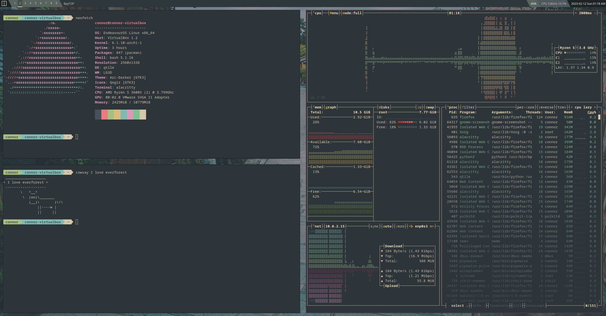

# Linux dotfiles for Qtile
based off of the [Everforest theme](https://github.com/sainnhe/everforest)
---



# Dependencies
Qtilewm + Qtile extras

### Arch Based
```
sudo pacman -S qtile
yay -S qtile-extras-git
```
### Debian Based / Ubuntu
```
sudo apt-get install qtile
```
clone [qtile extras repo](https://github.com/elParaguayo/qtile-extras) and run `python setup.py install`

## Other dependencies
| **Dependency**                                        | **Description**   |
|-------------------------------------------------------|-------------------|
| [feh](https://github.com/derf/feh)                    | wallpaper manager |
| [rofi](https://github.com/davatorium/rofi)            | run menu          |
| [alacritty](https://github.com/alacritty/alacritty)   | terminal          |
| [bpytop](https://github.com/aristocratos/bpytop)      | task manager      |
| [synth](https://github.com/andresgongora/synth-shell) | shell prompt      |
| [ranger](https://github.com/ranger/ranger)            | CLI file manager  |

# Installation
1. Ensure dependencies are met
2. Clone this repo to your `~/.config/` folder
3. Edit `.config/qtile/config.py` to choose default apps
4. Edit `.config/qtile/autostart.sh` to set the file path to your desired wallpaper and set startup processes

## Other useful/cool applications
- `neofetch` for system info
- `nemo` gui file manager
- `firefox` open source browser
- `xcompmgr` or `picom` composite managers for transparent windows and animations
